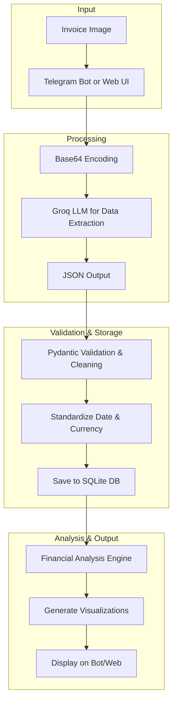

# 🧾 AI Invoice Processing System

A comprehensive AI-powered invoice processing system that extracts structured data from invoice images, stores it in a database, performs financial analysis, and provides interfaces via a Telegram Bot and a Streamlit Web App.

## 🚀 Features

### Core Processing
- **🤖 AI-Powered OCR**: Extracts structured data from invoice images using Groq LLM (Meta-Llama models).
- **✅ Data Validation**: Pydantic models with robust date formatting and transaction type auto-detection.
- **🔄 Batch Processing**: Process individual invoices or entire directories via CLI.
- **📷 Multi-Format Support**: Handles JPG, JPEG, and PNG image formats.

### Data Management
- **💾 SQLite Database**: Simple and effective relational schema for invoices and items.
- **📊 Data Analysis**: Provides summaries, top vendor analysis, and spending trends.
- **📈 Visualization**: Generates comprehensive dashboards and plots for financial insights.

### User Interfaces
- **📱 Telegram Bot**: An interactive bot for on-the-go invoice management.
  - **📤 Upload Invoices**: Process invoices by sending a photo directly to the bot.
  - **📊 View Summaries**: Get instant financial summaries and analysis.
  - **📈 Get Visualizations**: Generate and view spending dashboards.
  - **💰 Spending Limits**: Set and check monthly spending limits with alerts.
  - **📜 Recent Invoices**: Quickly view your last 5 transactions.
- **🌐 Streamlit Web App**: A full-featured web interface for in-depth analysis.
- **💻 Command Line**: Direct Python API and CLI tools for batch processing.

## 📁 Project Structure

```
hackathon/
├── README.md                      # This comprehensive guide
└── invoice_rag/                   # Main application directory
    ├── src/                       # Core application logic
    │   ├── processor.py           # 🤖 Main invoice processing engine
    │   ├── database.py            # 💾 Database models and utilities
    │   └── analysis.py            # 📊 Financial analysis engine
    │
    ├── telegram_bot/              # 📱 Telegram Bot interface
    │   ├── bot.py                 # 🤖 Main bot logic and command handlers
    │   ├── visualizations.py      # 📈 Generates charts and dashboards
    │   └── spending_limits.py     # 💰 Manages user spending limits
    │
    ├── streamlit/                 # 🌐 Web Interface
    │   └── app.py                 # Full-featured Streamlit web app
    │
    ├── invoices/                  # 📁 Input directory for invoice images
    │   ├── test1.jpg
    │   └── ...
    │
    ├── requirements.txt           # 📦 Python dependencies
    ├── .env.example               # 🔧 Environment template
    ├── run_bot.py                 # ▶️ Script to run the Telegram bot
    ├── run.py                     # ▶️ Script for batch processing
    └── invoices.db                # 💽 SQLite database
```

## 🛠️ Installation & Setup

### 1. Clone & Navigate
```bash
git clone <your-repo-url>
cd hackathon/invoice_rag
```

### 2. Install Dependencies
```bash
# Using pip (recommended)
pip install -r requirements.txt

# Using uv (faster alternative)
uv pip install -r requirements.txt
```

### 3. Environment Setup
Copy the environment template and add your API keys.

```bash
cp .env.example .env
```

Edit the `.env` file with your keys:
```
GROQ_API_KEY="your_groq_api_key_here"
TELEGRAM_BOT_TOKEN="your_telegram_bot_token_here"
```

- **Groq API Key**: Get from the [Groq Console](https://console.groq.com/).
- **Telegram Bot Token**: Get by talking to [@BotFather](https://t.me/botfather) on Telegram.

## 🚀 Quick Start

You can run the Telegram Bot, the Streamlit Web App, or use the command line for processing.

### 1. Telegram Bot (Recommended for daily use)
Run the bot with the dedicated script:
```bash
python run_bot.py
```
Interact with your bot on Telegram. You can upload invoices, view summaries, set spending limits, and get visual analytics.

**Bot Commands:**
- `/start` - Start the bot and show the main menu.
- `/upload_invoice` - Instructions on how to upload an invoice.
- `/view_summary` - Get a summary of all your invoices.
- `/recent_invoices` - Show your 5 most recent invoices.
- `/visualizations` - Generate and view a spending analysis dashboard.
- `/set_limit <amount>` - Set your monthly spending limit.
- `/check_limit` - Check your spending against your limit.
- `/help` - Show the help message.

### 2. Web Interface (For detailed analysis)
```bash
streamlit run streamlit/app.py
```
Access the web app at: `http://localhost:8501`

### 3. Command Line Processing
To process all images in the `invoices/` directory and save them to the database:
```bash
python run.py
```

## 📊 Database Schema

The database uses a simplified and robust schema to store invoice data.

### `invoices` Table
| Field | Type | Description |
|--------------------|---------|------------------------------------------|
| `id` | INTEGER | Primary Key |
| `shop_name` | TEXT | Name of the shop or vendor |
| `invoice_date` | TEXT | Date from the invoice (YYYY-MM-DD) |
| `total_amount` | REAL | The final total amount of the invoice |
| `transaction_type` | TEXT | Type: `bank`, `retail`, or `e-commerce` |
| `processed_at` | TIMESTAMP| Timestamp when the invoice was processed |
| `image_path` | TEXT | Path to the original invoice image |

### `invoice_items` Table
| Field | Type | Description |
|-------------|---------|------------------------------------|
| `id` | INTEGER | Primary Key |
| `invoice_id` | INTEGER | Foreign key to the `invoices` table |
| `item_name` | TEXT | Name of the purchased item |
| `quantity` | INTEGER | Quantity of the item |
| `unit_price` | REAL | Price per unit of the item |
| `total_price` | REAL | Total price for the line item |

### `spending_limits` Table
| Field | Type | Description |
|---------------|---------|------------------------------------|
| `user_id` | INTEGER | Telegram User ID (Primary Key) |
| `monthly_limit` | REAL | The spending limit amount for the month|
| `created_at` | TIMESTAMP| Timestamp of creation |
| `updated_at` | TIMESTAMP| Timestamp of the last update |

## 🤖 AI Processing Pipeline

The system uses a sophisticated pipeline to ensure data accuracy and consistency.



**Key Features of the Pipeline:**
- **Smart Currency Parsing**: Handles various Indonesian currency formats (e.g., `59.385`, `6.000.000`, `25,500`) and converts them reliably.
- **Robust Validation**: Pydantic models validate incoming data, standardize date formats to `YYYY-MM-DD`, and auto-detect transaction types.
- **Error Recovery**: Gracefully handles failures in LLM parsing or data validation.

## 🤝 Contributing

1. Fork the repository.
2. Create a feature branch (`git checkout -b feature/amazing-feature`).
3. Commit your changes (`git commit -m 'Add amazing feature'`).
4. Push to the branch (`git push origin feature/amazing-feature`).
5. Open a Pull Request.

## 📝 License

This project is licensed under the MIT License.

---

**🎉 Happy Invoice Processing!** 📄✨
