# 🧾 AI Invoice Processing System

A comprehensive AI-powered invoice processing system that extracts structured data from invoice images, stores it in a database, performs financial analysis, and provides interfaces via **Telegram Bot**, **WhatsApp Bot**, and a **Streamlit Web App**.

## 🚀 Features

### Core Processing
- **🤖 AI-Powered OCR**: Extracts structured data from invoice images using Groq LLM (Meta-Llama models).
- **✅ Data Validation**: Pydantic models with robust date formatting and transaction type auto-detection.
- **🔄 Batch Processing**: Process individual invoices or entire directories via CLI.
- **📷 Multi-Format Support**: Handles JPG, JPEG, and PNG image formats.

### Data Management
- **💾 SQLite Database**: Simple and effective relational schema for invoices and items.
- **📊 Data Analysis**: Provides summaries, top vendor analysis, and spending trends.
- **📈 Visualization**: Generates comprehensive dashboards and plots for financial insights.
- **🔄 Multi-Platform**: Supports both Telegram and WhatsApp with unified database.

### User Interfaces
- **📱 Telegram Bot**: An interactive bot for on-the-go invoice management.
  - **📤 Upload Invoices**: Process invoices by sending a photo directly to the bot.
  - **📊 View Summaries**: Get instant financial summaries and analysis.
  - **📈 Get Visualizations**: Generate and view spending dashboards.
  - **💰 Spending Limits**: Set and check monthly spending limits with alerts.
  - **📜 Recent Invoices**: Quickly view your last 5 transactions.
- **💬 WhatsApp Bot**: Full-featured WhatsApp integration via WAHA + n8n.
  - **📸 Photo Processing**: Send invoice photos directly via WhatsApp.
  - **� Smart Commands**: Indonesian language commands (`analysis`, `setlimit`, etc.).
  - **📊 Rich Analytics**: Visual spending analysis sent as images.
  - **⚡ Real-time Alerts**: Budget limit notifications and warnings.
  - **🔄 Seamless Integration**: Uses n8n for webhook management.
- **�🌐 Streamlit Web App**: A full-featured web interface for in-depth analysis.
- **💻 Command Line**: Direct Python API and CLI tools for batch processing.

## 📁 Project Structure

```
hackathon/
├── README.md                      # This comprehensive guide
└── invoice_rag/                   # Main application directory
    ├── src/                       # Core application logic
    │   ├── processor.py           # 🤖 Main invoice processing engine
    │   ├── database.py            # 💾 Database models and utilities
    │   └── analysis.py            # 📊 Financial analysis engine
    │
    ├── telegram_bot/              # 📱 Telegram Bot interface
    │   ├── bot.py                 # 🤖 Main bot logic and command handlers
    │   ├── visualizations.py      # 📈 Generates charts and dashboards
    │   └── spending_limits.py     # 💰 Manages user spending limits
    │
    ├── whatsapp_bot/              # 💬 WhatsApp Bot interface
    │   ├── bot.py                 # 🤖 Main WhatsApp bot with FastAPI
    │   ├── waha_client.py         # 📞 WAHA API client wrapper
    │   ├── n8n_client.py          # 🔄 n8n workflow integration
    │   ├── message_handler.py     # 📨 WhatsApp message processing
    │   └── platform_database.py   # 🗄️ Multi-platform database adapter
    │
    ├── n8n_workflows/             # 🔄 n8n Workflow configurations
    │   ├── setup-guide.md         # 📖 Complete n8n setup guide
    │   ├── whatsapp-message-processor.json  # 🔧 Main n8n workflow
    │   └── webhook-examples.md    # 📝 Webhook payload examples
    │
    ├── streamlit/                 # 🌐 Web Interface
    │   └── app.py                 # Full-featured Streamlit web app
    │
    ├── invoices/                  # 📁 Input directory for invoice images
    │   ├── test1.jpg
    │   └── ...
    │
    │
    ├── requirements.txt           # 📦 Python dependencies (updated for WhatsApp)
    ├── .env.example               # 🔧 Environment template
    ├── run_bot.py                 # ▶️ Script to run the Telegram bot
    ├── run_whatsapp_bot.py        # ▶️ Script to run the WhatsApp bot
    ├── run_all_bots.py            # ▶️ Script to run both bots
    ├── run.py                     # ▶️ Script for batch processing
    └── invoices.db                # 💽 SQLite database
```

## 🛠️ Installation & Setup

### 1. Clone & Navigate
```bash
git clone <your-repo-url>
cd hackathon/invoice_rag
```

### 2. Install Dependencies
```bash
# Using pip (recommended)
pip install -r requirements.txt

# Using uv (faster alternative)
uv pip install -r requirements.txt
```

### 3. Environment Setup
Copy the environment template and add your API keys.

```bash
cp .env.example .env
```

Edit the `.env` file with your keys:
```
# Core API Keys
GROQ_API_KEY="your_groq_api_key_here"
TELEGRAM_BOT_TOKEN="your_telegram_bot_token_here"

# WhatsApp Bot Configuration (WAHA + n8n)
WAHA_URL=http://localhost:3000
WAHA_API_KEY=your_waha_api_key_here
WHATSAPP_SESSION_NAME=invoice_bot_session

# n8n Webhook Configuration
N8N_URL=http://localhost:5678
N8N_WEBHOOK_URL=http://localhost:5678/webhook/whatsapp-invoice-bot
N8N_API_KEY=your_n8n_api_key_here

# Bot Platform Configuration
ENABLE_TELEGRAM_BOT=true
ENABLE_WHATSAPP_BOT=true
```

**Required API Keys:**
- **Groq API Key**: Get from the [Groq Console](https://console.groq.com/).
- **Telegram Bot Token**: Get by talking to [@BotFather](https://t.me/botfather) on Telegram.

**WhatsApp Setup (Optional):**
- **WAHA Server**: Run `docker run -it --rm --name waha -p 3000:3000/tcp devlikeapro/waha`
- **n8n Server**: Run `docker run -it --rm --name n8n -p 5678:5678 n8nio/n8n`

## 🚀 Quick Start

You can run **both bots simultaneously**, individual bots, the Streamlit Web App, or use the command line for processing.

### 🤖 Run Both Bots (Recommended)
Run both Telegram and WhatsApp bots simultaneously:
```bash
python run_all_bots.py
```
This starts both bots in separate processes with unified database and shared functionality.

### 1. Telegram Bot (Individual)
Run the Telegram bot only:
```bash
python run_bot.py
```
Interact with your bot on Telegram. You can upload invoices, view summaries, set spending limits, and get visual analytics.

**Telegram Commands:**
- `/start` - Start the bot and show the main menu.
- `/upload_invoice` - Instructions on how to upload an invoice.
- `/analysis` - Get analysis with visualization.
- `/recent_invoices` - Show your 5 most recent invoices.
- `/set_limit <amount>` - Set your monthly spending limit.
- `/check_limit` - Check your spending against your limit.
- `/help` - Show the help message.

### 2. WhatsApp Bot (Individual)
Run the WhatsApp bot only:
```bash
python run_whatsapp_bot.py
```

**Prerequisites for WhatsApp Bot:**
1. **Start WAHA server**: `docker run -it --rm --name waha -p 3000:3000/tcp devlikeapro/waha`
2. **Start n8n server**: `docker run -it --rm --name n8n -p 5678:5678 n8nio/n8n`
3. **Import n8n workflow**: Import `n8n_workflows/whatsapp-message-processor.json`
4. **Scan QR Code**: Get QR code from `http://localhost:8000/qr` and scan with WhatsApp

**WhatsApp Commands (Indonesian):**
- `start` - Mulai bot dan tampilkan menu.
- `analysis` - Lihat analisis pengeluaran dengan grafik.
- `recent` - 5 invoice terakhir.
- `setlimit 5000000` - Set budget bulanan (Rp 5 juta).
- `checklimit` - Cek status pengeluaran.
- `help` - Panduan bantuan.
- **Send Photos** - Langsung kirim foto struk/invoice.
- `/set_limit <amount>` - Set your monthly spending limit.
- `/check_limit` - Check your spending against your limit.
- `/help` - Show the help message.

### 3. Web Interface (For detailed analysis)
```bash
streamlit run streamlit/app.py
```
Access the web app at: `http://localhost:8501`

### 4. Command Line Processing
To process all images in the `invoices/` directory and save them to the database:
```bash
python run.py
```

## 🐳 Docker Deployment (Recommended for Production)

For easy deployment with all services:

```bash
# Full stack deployment
docker-compose up -d

# With all services (Telegram + Web App)
docker-compose --profile telegram --profile web up -d
```

See [`DOCKER.md`](DOCKER.md) for detailed Docker setup guide.

## 📊 Database Schema

The database uses a simplified and robust schema to store invoice data.

### `invoices` Table
| Field | Type | Description |
|--------------------|---------|------------------------------------------|
| `id` | INTEGER | Primary Key |
| `shop_name` | TEXT | Name of the shop or vendor |
| `invoice_date` | TEXT | Date from the invoice (YYYY-MM-DD) |
| `total_amount` | REAL | The final total amount of the invoice |
| `transaction_type` | TEXT | Type: `bank`, `retail`, or `e-commerce` |
| `processed_at` | TIMESTAMP| Timestamp when the invoice was processed |
| `image_path` | TEXT | Path to the original invoice image |

### `invoice_items` Table
| Field | Type | Description |
|-------------|---------|------------------------------------|
| `id` | INTEGER | Primary Key |
| `invoice_id` | INTEGER | Foreign key to the `invoices` table |
| `item_name` | TEXT | Name of the purchased item |
| `quantity` | INTEGER | Quantity of the item |
| `unit_price` | REAL | Price per unit of the item |
| `total_price` | REAL | Total price for the line item |

### `platform_users` Table (Multi-Platform Support)
| Field | Type | Description |
|-------------|---------|------------------------------------|
| `id` | INTEGER | Primary Key |
| `platform` | TEXT | Platform: `telegram` or `whatsapp` |
| `platform_user_id` | TEXT | User ID from platform (Telegram ID or Phone) |
| `display_name` | TEXT | User's display name |
| `phone_number` | TEXT | Phone number (for WhatsApp users) |
| `created_at` | TIMESTAMP| User creation timestamp |
| `last_active` | TIMESTAMP| Last activity timestamp |

### `spending_limits_v2` Table (Enhanced)
| Field | Type | Description |
|---------------|---------|------------------------------------|
| `id` | INTEGER | Primary Key |
| `user_id` | INTEGER | Foreign key to `platform_users.id` |
| `monthly_limit` | REAL | The spending limit amount for the month|
| `created_at` | TIMESTAMP| Timestamp of creation |
| `updated_at` | TIMESTAMP| Timestamp of the last update |

## 🔄 Multi-Platform Architecture

The system now supports both Telegram and WhatsApp with unified data processing:

```mermaid
graph TD
    subgraph "Input Channels"
        A[Telegram Bot] 
        B[WhatsApp → WAHA → n8n → Python Bot]
        C[Streamlit Web App]
        D[CLI/API]
    end
    
    subgraph "Core Processing"
        E[Groq LLM Processing]
        F[Pydantic Validation]
        G[SQLite Database]
    end
    
    subgraph "Analysis & Output"
        H[Financial Analysis]
        I[Visualization Generation]
        J[Multi-Platform Response]
    end
    
    A --> E
    B --> E
    C --> E
    D --> E
    
    E --> F --> G
    G --> H --> I --> J
    J --> A
    J --> B
    J --> C
```



## 🤖 AI Processing Pipeline

The system uses a sophisticated pipeline to ensure data accuracy and consistency across all platforms.


**Enhanced Pipeline Features:**
- **Multi-Platform Input**: Handles Telegram, WhatsApp, Web, and CLI inputs uniformly
- **Smart Currency Parsing**: Handles various Indonesian currency formats (e.g., `59.385`, `6.000.000`, `25,500`)
- **Cross-Platform User Management**: Unified user tracking across Telegram and WhatsApp
- **Robust Validation**: Pydantic models with date standardization to `YYYY-MM-DD`
- **Platform-Aware Responses**: Tailored responses for each platform (Indonesian for WhatsApp, English for Telegram)

## 🔧 API Endpoints (WhatsApp Bot)

The WhatsApp bot exposes several API endpoints for integration and testing:

| Endpoint | Method | Description |
|----------|--------|-------------|
| `/` | GET | Health check |
| `/status` | GET | Bot and WAHA status |
| `/qr` | GET | Get QR code for WhatsApp pairing |
| `/webhook/whatsapp` | POST | Main webhook for message processing |
| `/webhook/n8n` | POST | Alternative n8n webhook endpoint |
| `/send/text` | POST | Send text message (testing) |
| `/send/image` | POST | Send image message (testing) |

## 🚨 Troubleshooting

### Common Issues

#### WhatsApp Bot Issues
1. **QR Code tidak muncul**:
   ```bash
   # Check WAHA status
   curl http://localhost:3000/api/sessions/invoice_bot_session
   
   # Restart WAHA
   docker restart waha
   ```

2. **n8n workflow tidak jalan**:
   - Verify workflow import berhasil
   - Check webhook URL configuration
   - Check environment variables

3. **Bot tidak respond**:
   ```bash
   # Check bot logs
   docker logs invoice-whatsapp-bot
   
   # Test webhook manual
   curl -X POST http://localhost:8000/webhook/whatsapp \
     -H "Content-Type: application/json" \
     -d '{"event": "message", "data": {"from": "test", "type": "text", "body": "start"}}'
   ```

#### Telegram Bot Issues
1. **Bot tidak start**:
   - Verify `TELEGRAM_BOT_TOKEN` in .env
   - Check internet connection
   - Check bot permissions dengan @BotFather

2. **Image processing gagal**:
   - Check `GROQ_API_KEY` valid
   - Verify image format (JPG/PNG)
   - Check file size (<20MB)

#### Database Issues
1. **Database migration**:
   ```bash
   # Backup database
   cp invoices.db invoices.db.backup
   
   # Run bot untuk auto-migration
   python run_whatsapp_bot.py
   ```

### Getting Help

1. **Check Logs**: Always check application logs first
2. **Environment Variables**: Verify all required variables are set
3. **API Keys**: Ensure all API keys are valid and have proper permissions
4. **Network**: Check if all services can communicate
5. **Documentation**: Refer to `n8n_workflows/setup-guide.md` for detailed setup

## 🔗 Related Files

- [`DOCKER.md`](DOCKER.md) - Complete Docker deployment guide
- [`n8n_workflows/setup-guide.md`](n8n_workflows/setup-guide.md) - n8n configuration guide  
- [`n8n_workflows/webhook-examples.md`](n8n_workflows/webhook-examples.md) - Webhook payload examples
- [`.env.example`](.env.example) - Environment variables template

## 🤝 Contributing

1. Fork the repository.
2. Create a feature branch (`git checkout -b feature/amazing-feature`).
3. Commit your changes (`git commit -m 'Add amazing feature'`).
4. Push to the branch (`git push origin feature/amazing-feature`).
5. Open a Pull Request.

## 📝 License

This project is licensed under the MIT License.

---

**🎉 Happy Invoice Processing dengan Multi-Platform Support!** 📄✨📱💬
