# 📱 User Workflows - Invoice Processing System

This document describes the detailed user workflows for the Invoice Processing System, focusing on the Telegram Bot and CLI interfaces.

---

## 🎯 Overview

The system supports two main user types:
1. **Interactive Users** - Using Telegram Bot for on-the-go invoice management
2. **Batch Users** - Using CLI for processing multiple invoices at once

---

## 📱 Telegram Bot Workflows

### 1️⃣ First-Time User Setup


**Steps:**
1. Open Telegram and search for your bot
2. Click "Start" or send `/start`
3. Bot displays welcome message with menu buttons
4. *Optional:* Set monthly budget with `/set_limit <amount>`
5. Ready to start uploading invoices!

**Commands Used:**
- `/start` - Initialize bot
- `/set_limit 5000000` - Set budget to Rp 5,000,000

---

### 2️⃣ Daily Invoice Processing

```mermaid
graph TD
    A[User Has Receipt] --> B[Open Telegram Bot]
    B --> C[Take Photo or Select from Gallery]
    C --> D[Send Photo to Bot]
    D --> E[Bot: Processing...]
    E --> F[AI Extracts Data]
    F --> G{Extraction Success?}
    
    G -->|Yes| H[Bot Shows Invoice Details]
    H --> I{Over Budget?}
    I -->|Yes| J[⚠️ Budget Warning Sent]
    I -->|No| K[✅ Saved Successfully]
    J --> K
    
    G -->|No| L[❌ Error Message]
    L --> M[User Retakes Photo]
    M --> D
    
    style A fill:#e3f2fd
    style D fill:#fff9c4
    style H fill:#c8e6c9
    style J fill:#ffccbc
    style L fill:#ef9a9a
```



**Steps:**
1. Take a photo of your receipt/invoice
2. Open the Telegram bot
3. Send the photo directly (no command needed)
4. Wait for processing (5-10 seconds)
5. Receive confirmation with extracted details
6. Get budget warning if spending exceeds limit

**No Commands Needed** - Just send the photo!

**What Bot Extracts:**
- 📅 Date
- 🏢 Shop/Vendor Name
- 💰 Total Amount
- 📝 Line Items
- 🏷️ Transaction Type (Bank/Retail/E-commerce)

---

### 3️⃣ Viewing Financial Analysis

```mermaid
graph TD
    A[User Wants Analysis] --> B{Choose Method}
    
    B -->|Quick Summary| C[Send /analysis]
    C --> D[Bot Shows Text Summary]
    D --> E[Bot Generates Dashboard]
    E --> F[📊 Visual Dashboard Sent]
    
    B -->|Recent Items| G[Send /recent_invoices]
    G --> H[Bot Shows Last 5 Invoices]
    
    B -->|Budget Status| I[Send /check_limit]
    I --> J[Bot Shows Budget Status]
    J --> K{Status}
    K -->|Under Budget| L[✅ Green Status]
    K -->|Near Limit| M[⚡ Warning Status]
    K -->|Over Limit| N[🚫 Alert Status]
    
    style A fill:#e3f2fd
    style F fill:#c8e6c9
    style H fill:#c8e6c9
    style L fill:#c8e6c9
    style M fill:#fff9c4
    style N fill:#ffccbc
```



**Quick Analysis:**
```
User: /analysis
Bot: 📊 Invoice Summary
     Total Invoices: 25
     Total Spent: Rp 5,234,500
     Average Amount: Rp 209,380
     
     Top Vendors:
     • Alfamart: Rp 1,250,000
     • Indomaret: Rp 890,000
     • Shopee: Rp 650,000
     
     📊 Generating dashboard...
     [Sends comprehensive visual dashboard]
```

**Recent Invoices:**
```
User: /recent_invoices
Bot: 🧾 Your Recent Invoices:
     
     📅 2025-10-20
     🏢 Alfamart
     💰 Rp 125,500
     ───────────────
     📅 2025-10-19
     🏢 Shopee
     💰 Rp 450,000
     ───────────────
     [Shows 5 most recent]
```

**Budget Check:**
```
User: /check_limit
Bot: ✅ Monthly Spending Status
     
     Monthly Limit: Rp 5,000,000
     Total Spent: Rp 3,456,780
     Remaining: Rp 1,543,220
     Usage: 69.1%
```

---

### 4️⃣ AI Chat for Insights


**One-off Chat (Default):**
```
User: /chat How much did I spend at Alfamart this month?
Bot: 🤔 Thinking...
     Based on your data, you spent Rp 1,250,000 at Alfamart
     this month across 8 transactions. Your average purchase
     was Rp 156,250.
```

**Continuous Chat Mode:**
```
User: /chatmode on
Bot: ✅ Chat mode enabled!
     I'll now respond to all your messages.

User: What's my biggest expense?
Bot: Your biggest single expense was Rp 850,000 at
     Electronic City on Oct 15, 2025.

User: How does this month compare to last month?
Bot: This month you've spent 15% more than last month...
     [AI provides detailed comparison]

User: /chatmode off
Bot: ❌ Chat mode disabled.
     Use /chat <message> for one-off queries.
```

**Chat History Management:**
```
User: /clear
Bot: Your chat history has been cleared.
```

---

### 5️⃣ Budget Management

```mermaid
graph TD
    A[User Wants Budget] --> B[Send /set_limit amount]
    B --> C[Bot Validates Amount]
    C --> D{Valid?}
    
    D -->|Yes| E[Budget Saved]
    E --> F[Confirmation Sent]
    
    D -->|No| G[Error: Must be > 0]
    G --> H[User Resends]
    H --> B
    
    I[Upload Invoice] --> J{Check Budget}
    J -->|< 75%| K[✅ Normal]
    J -->|75-89%| L[⚡ Getting Close]
    J -->|90-99%| M[⚠️ Near Limit]
    J -->|≥ 100%| N[🚫 Over Limit]
    
    N --> O[Send Alert]
    M --> O
    L --> P[No Alert]
    K --> P
    
    style E fill:#c8e6c9
    style G fill:#ef9a9a
    style K fill:#c8e6c9
    style L fill:#fff9c4
    style M fill:#ffccbc
    style N fill:#ef9a9a
```



**Setting Budget:**
```
User: /set_limit 5000000
Bot: ✅ Monthly spending limit set to Rp 5,000,000
     You'll be notified when your spending approaches
     or exceeds this limit.
```

**Budget Alerts (Automatic):**

*At 90% Usage:*
```
Bot: ⚡ ALERT: You're approaching your monthly spending limit!
     
     Monthly Limit: Rp 5,000,000
     Total Spent: Rp 4,650,000
     Remaining: Rp 350,000
     Usage: 93.0%
```

*Over Limit:*
```
Bot: ⚠️ WARNING: This purchase exceeds your monthly limit!
     
     Monthly Limit: Rp 5,000,000
     Total Spent: Rp 5,234,500
     Over Budget: Rp 234,500
     Usage: 104.7%
```

---

## 💻 CLI Batch Processing Workflow

### 6️⃣ Bulk Invoice Processing


**Step-by-Step Process:**

1. **Prepare Images:**
   ```bash
   # Create invoices folder if it doesn't exist
   mkdir invoices
   
   # Copy all invoice images
   cp ~/Downloads/receipt*.jpg invoices/
   ```

2. **Run Processor:**
   ```powershell
   # Navigate to project
   cd D:\Codings\hackathon\invoice_rag
   
   # Run batch processor
   python run.py
   ```

3. **Console Output:**
   ```
   INVOICE PROCESSOR
   ==================================================
   Processing invoice images...
   
   Processing: receipt1.jpg
      [SUCCESS] Extracted: Alfamart - Rp 125,500
      [SUCCESS] Saved to database with ID: 1
   
   Processing: receipt2.jpg
      [SUCCESS] Extracted: Indomaret - Rp 89,000
      [SUCCESS] Saved to database with ID: 2
   
   Processing: receipt3.jpg
      [SUCCESS] Extracted: Shopee - Rp 450,000
      [SUCCESS] Saved to database with ID: 3
   
   PROCESSING COMPLETE!
   Processed 3/3 invoices successfully
   Total amount: Rp 664,500
   All dates standardized to YYYY-MM-DD format
   ```

4. **Verify Results:**
   ```powershell
   # Check database (if you have a viewer script)
   python check_database.py
   ```

---

## 🔄 Complete User Journey

### Example: Weekly Invoice Management

```mermaid
graph TD
    A[Monday Morning] --> B[Upload Grocery Receipt via Bot]
    B --> C[Bot Confirms: Rp 345,000]
    
    D[Wednesday] --> E[Upload Restaurant Receipt]
    E --> F[Bot Confirms: Rp 250,000]
    
    G[Friday] --> H[Online Shopping Invoice]
    H --> I[Bot Confirms: Rp 890,000]
    I --> J[⚡ Budget Alert: 85% Used]
    
    K[Weekend] --> L[Check Spending]
    L --> M[Send /analysis]
    M --> N[View Dashboard]
    N --> O{Satisfied?}
    
    O -->|Yes| P[Continue Tracking]
    O -->|No| Q[Ask AI: /chat How to reduce spending?]
    Q --> R[AI Provides Insights]
    R --> S[Adjust Habits]
    
    style B fill:#fff9c4
    style E fill:#fff9c4
    style H fill:#fff9c4
    style J fill:#ffccbc
    style N fill:#c8e6c9
    style R fill:#c8e6c9
```



**Weekly Routine:**

**Monday - Wednesday:**
- Upload receipts as you shop
- Quick photo → send to bot
- Get instant confirmation

**Thursday - Friday:**
- Continue uploading
- Receive budget alerts if needed
- Adjust spending based on alerts

**Weekend:**
- Review weekly spending with `/analysis`
- Check detailed dashboard
- Ask AI for insights if needed
- Plan next week's budget

---

## 🎓 Power User Tips

### Efficient Workflows

**Morning Routine:**
```
1. Open Telegram
2. Send yesterday's receipts (batch upload)
3. Check /check_limit for budget status
4. Start day informed
```

**End of Week:**
```
1. Send /analysis for comprehensive view
2. Review spending dashboard
3. Use /chat to ask:
   - "What category did I spend most on?"
   - "How does this week compare to last week?"
   - "Where can I cut costs?"
```

**Month End:**
```
1. Full analysis: /analysis
2. Export/screenshot dashboard for records
3. Review budget: /check_limit
4. Set next month's budget: /set_limit <new_amount>
5. Clear chat history: /clear (fresh start)
```

---

## 📊 Dashboard Features Explained

### What You See in the Dashboard

**4 Key Metrics (KPI Cards):**

1. **💰 Total Spending**
   - Your total expenses for the period
   - Formatted with K/M suffixes (e.g., Rp 2.5M)

2. **📊 Weekly Average**
   - Average spending per week
   - Helps understand spending rate

3. **🏪 Top Vendor**
   - Shop/vendor you spent most at
   - Shows total amount

4. **💳 Budget Status** (New!)
   - Color-coded: 🟢 Green (safe) / 🟠 Orange (warning) / 🔴 Red (over)
   - Shows percentage used
   - Personalized per user

**Visual Charts:**

1. **Spending Trend**
   - Line graph showing spending over time
   - Helps identify patterns

2. **Top 5 Vendors**
   - Bar chart of your most visited shops
   - Easy to spot spending concentrations

3. **Transaction Types**
   - Pie chart: Bank / Retail / E-commerce
   - Understand payment method distribution

4. **Daily Spending**
   - Bar chart of daily totals
   - Identify high-spending days

**Insights Section:**
- AI-generated observations
- Budget status
- Spending trends
- Recommendations

---

## ❓ Common Questions

**Q: Can I upload multiple photos at once?**
A: Yes! Just send them one after another. The bot processes each separately.

**Q: What if the image is unclear?**
A: The bot will say "Failed to process" - retake with better lighting/focus.

**Q: How do I delete an invoice?**
A: Currently not supported via bot. Contact admin or use database directly.

**Q: Does chat mode cost money?**
A: It uses API credits. Use `/chatmode off` to save costs. Use `/chat` for one-off queries.

**Q: Can I change my budget mid-month?**
A: Yes! Just use `/set_limit <new_amount>` anytime.

**Q: How far back does analysis go?**
A: Default is 4 weeks. The dashboard shows trends based on available data.

---

## 🚀 Getting Started Checklist

### For New Users:

- [ ] Find bot on Telegram
- [ ] Send `/start` command
- [ ] Read welcome message
- [ ] Set budget with `/set_limit`
- [ ] Upload first invoice (take photo)
- [ ] Check it saved: `/recent_invoices`
- [ ] View analysis: `/analysis`
- [ ] Try asking: `/chat What's my total spending?`
- [ ] Explore other commands: `/help`

### For Advanced Users:

- [ ] Enable chat mode for deep analysis
- [ ] Set up monthly budget tracking
- [ ] Use CLI for bulk historical data
- [ ] Review dashboard weekly
- [ ] Track spending trends
- [ ] Adjust budget based on insights

---

**Ready to start tracking your finances? Send `/start` to your bot! 🎉**
